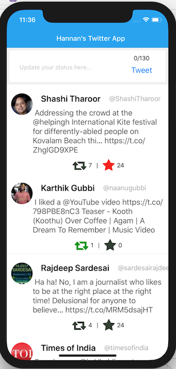
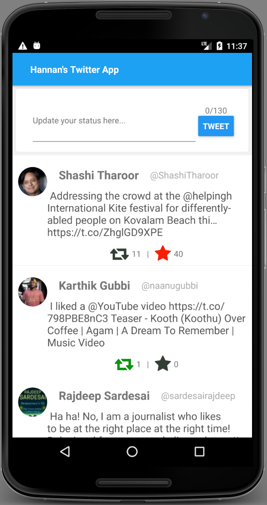

#  Hannan's Twitter App

* Standard compliant React Native App Utilizing [Ignite](https://github.com/infinitered/ignite)

## Screenshot

## How to Setup

**Step 1:** `git clone this repo: git@github.com:HannanShaik/TwitterApp.git`

**Step 2:** cd to the cloned repo: `cd TwitterApp`

**Step 3:** Install the Application with `yarn` or `npm i`

## How to Run App

1. cd to the repo
2. Run Build for either OS
  * for iOS
    * run `react-native run-ios`
  * for Android
    * run `react-native run-android`

## Features

* Login with Twitter
* Fetch Home Timeline of logged in user
* Post Status update on Twitter
* Like or Mark tweet as favorite
* ReTweet a status tweet
* Swipe Gesture for above actions

## Working Video

iOS - [Click to watch](https://drive.google.com/open?id=1OBSskwz39n7E5MysOXmHPx4E6inD6x82) 

Android - [Click to watch](https://drive.google.com/open?id=1SC6G7oq8IFNq0WtcesKPfMnoMGpesJ9d)

## Library Used

* Twitter Login & API access -  [react-native-oauth](https://github.com/fullstackreact/react-native-oauth)
* Swipe Gesture - [react-native-swipe-list-view](https://github.com/jemise111/react-native-swipe-list-view)
* Navigation - [react-navigation](https://github.com/react-navigation/react-navigation)

## Contributor [Hannan Shaik](http://hannanshaik.com)